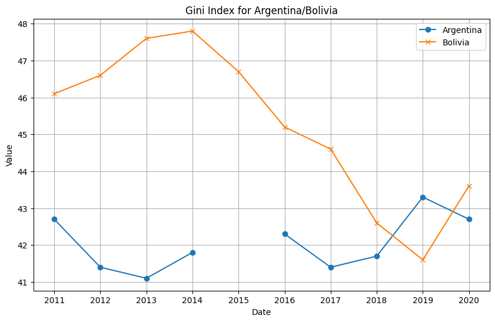
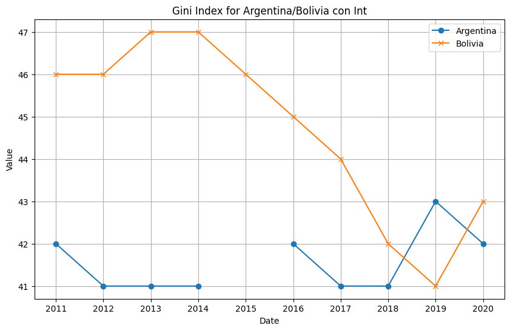

# Práctico #2 - Calculadora de índices GINI
### Materia:  Sistemas de Control 2024 FCEFyN-UNC
### Grupo: CBD
#### Integrantes
* GONZALEZ, BRUNO		43134492	I.Electrónica	fork  
* GARCÍA, ANGEL DOMINGO		32797989	I.Comp.		https://github.com/domingolu/Practico-2

## Contenido
	- Introducción
	- Implementación
	- Results
	- Debug
	- 
<a name="introducción"></a>
## Introducción
Se pretente implementar una interfaz que muestre el índice GINI. La capa superior recuperará la información del banco mundial https://api.worldbank.org/v2/en/country/all/indicator/SI.POV.GINI?format=json&date=2011:2020&per_page=32500&page=1&country=%22Argentina%22. Se utiliza API Rest y Python. Los datos de consulta son entregados a un programa en C (capa intermedia) para procesarlos en finalmente en assembler que convierte valores de float a enteros y devuelve el índice de un país como Argentina y otro. Luego el script python muestra los datos obtenidos. Para interfacear los distintos bloques de código debimos tener en cuenta la convención de llamadas.
El código fuente comentado se puede consultar en el directorio "Source Code".

<a name="implementación"></a>
## Implementación

0. Para poder ejecutar correctamente el código necesitamos migrar a python 32 bits, acorde al interfaceo entre las estructuras C y ASM. Para poder hacer esto se utilizó el recurso "Conda", el cual nos permitió modificar la versión de python.
Conda es una herramienta de línea de comandos para la gestión de paquetes y entornos que se ejecuta en Windows, macOS y Linux.
   
1. Compilamos el código ASM en un objeto de código objeto:
```python
 !nasm -f -elf32 convertirFloatAEntero.asm -o convertirFloatAEntero.o  
```

2. Compilamos el código en C en un objeto de código objeto:
```python
!gcc -m32 -c convertirFloatAEntero.c -o convertirFloatAEntero_c.o
```

3. Enlazamos los objetos de código objeto en una biblioteca compartida
```python
!gcc -m32 -shared convertirFloatAEntero.o convertirFloatAEntero_c.o -o libconvertirFloatAEntero.so
```

4. Ejecutamos el script Python
```python
python3 practico_2_calculadora_de_indices_gini_2_paises.py
```
Detalles del script Python:

Creamos un wrapper con ctypes para poder usar la librería de C con Python y poder llamar sus funciones:
```python
# Importamos la librería ctypes
import ctypes
# Cargamos la libreria
libconvertirFloatAEntero = ctypes.CDLL('./libconvertirFloatAEntero.so')
# Definimos los tipos de los argumentos de la función factorial
libconvertirFloatAEntero.convertirFloatAEntero.argtypes = (ctypes.c_float,)
# Definimos el tipo del retorno de la función factorial
libconvertirFloatAEntero.convertirFloatAEntero.restype = ctypes.c_int
# Creamos nuestra función en Python
# hace de Wrapper para llamar a la función de C
def  convertirFloatAEntero(num):
return libconvertirFloatAEntero.convertirFloatAEntero(num)
```

1. Se consultan los datos del índice GINI de Argentina en la siguiente api rest https://api.worldbank.org/v2/en/country/all/indicator/SI.POV.GINI? Se usa la requests library para mandar una GET request a la API y obtener el JSON response. Todo esto lo realizamos definiendo la función:

```python
def  obtener_indice_gini(pais)
```
- definición:
	- recibe como parámetro el String del país del cual se necesitan los datos
	- devuelve una lista de diccionarios con el año y su correspondiente valore GINI para el país solicitado
4.  En la estructura main del programa se llama dos veces a la función *obtener_indice_gini (pais)* para obtener los indices GINI de dos países.
- primero se grafican los datos tal cual se obtienen
- luego se utiliza la función de convención de llamada a C *convertirFloatAEntero (num)* para convertir todos los índices GINI de float a int. 
- Se grafica nuevamente para, finalmente, comparar los resultados

<a name="Results"></a>
## Results





## Debug

A partir de "testbench.c" hacemos una llamada a la función en Assmebler y realizamos el debug en gdb para comprobar que se cumplan las convenciones de llamadas en la interfaz entre el código escrito en c y el código escrito en asm.
Como define como parámetro el número 10.29 y se verifica que la función "float2int" lo convierta en entero.

```c
// Contenido de testbench.c
int main() {
    float num = 10.29;
    int num_int = float2int(num);
    printf("Resultado de la conversión: %f is %d\n", num, num_int);
    return 0;
}
 ```

<!-- Imágenes de la carpeta capturas -->


### Análisis de Instrucciones en Ensamblador

Vamos a analizar cada instrucción desde el breakpoint en `0x565561c3` hasta la línea `0x565561d4`.

### Descripción de Instrucciones

1. **0x565561c3: sub $0xc, %esp**
   - **Descripción:** Resta 12 (0xc en hexadecimal) al registro de pila `esp`, lo que crea un espacio en la pila para las variables locales o para pasar argumentos a una función.

2. **0x565561c6: push -0x10(%ebp)**
   - **Descripción:** Empuja (push) el valor en la dirección `ebp` a la pila.  Coloca el argumento de la función `float2int` en la pila.

3. **0x565561c9: call 0x56556020 <float2int>**
   - **Descripción:** Llama a la función en la dirección `0x56556020`, la cual es nuestro código en .asm `float2int`. Esta instrucción guarda la dirección de retorno (la siguiente instrucción, `0x565561ce`) en la pila y salta a la dirección de la función `float2int`.

4. **0x565561ce: add $0x10, %esp**
   - **Descripción:** Suma 16 (0x10 en hexadecimal) al registro de pila `esp`, lo que limpia la pila eliminando los argumentos pasados a la función `float2int`.

5. **0x565561d1: mov %eax, -0xc(%ebp)**
   - **Descripción:** Mueve el valor del registro `eax` a la dirección `-0xc(ebp)`. Generalmente, después de una llamada a función, el valor de retorno se encuentra en `eax`. Esta instrucción almacena el valor de retorno de `float2int` en una variable local en el marco de pila actual. En este caso, `eax` nos devuelve el valor del número convertido a entero


Se verifica que el dato a convertir sea el deseado


Al retomar al main se observa la restauración del esp, mostrando que no se ha perdido la referencia del programa principal. 


Se observa que `float2int` ha realizado la conversión cargando correctamente la variable `num_int`


Se verifica el print.
